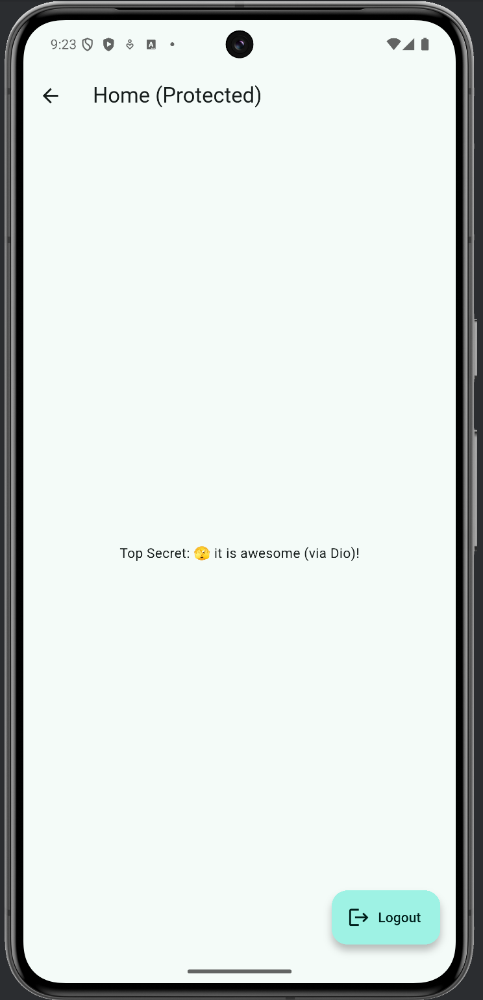

# Flutter AuthFlow Pro
Advanced Flutter demo app showing a **secure OAuth2 / OIDC PKCE flow** with token storage, Dio interceptors (Authorization + Refresh), and a mock backend — runs on **Android / iOS / Web**, no external server required.

---

## ✨ What this demonstrates
- **PKCE** (code verifier + S256 challenge) end-to-end
- **Token storage:** secure on mobile, local on web
- **Dio interceptors:** inject `Authorization`, refresh on 401, retry original request
- **Clean DI** via `GetIt`
- **Async safety** using `context.mounted` pattern
- **Mock servers** for `/authorize`, `/token`, and a protected `/secret`

---

## 🔐 Auth Flow (PKCE) — Diagram
This is the real sequence app simulates locally.


-------------------------------------------------------------------------
```text
🧱 Architecture
lib/
    app.dart
    main.dart
    routes/app_routes.dart
    core/
        di/locator.dart
        utils/pkce.dart
        storage/token_store.dart
        network/
                dio_client.dart
                auth_interceptor.dart
                refresh_interceptor.dart
        mock/
             mock_auth_server.dart
             mock_api_server.dart
    features/
        auth/
            data/auth_repository.dart
            domain.models/token_set.dart
            presentation/{login_page, consent_page, callback_page}.dart
        home/
            presentation/home_page.dart
```
-------------------------------------------------------------------------

* Key ideas

AuthRepository owns the flow: beginAuth → exchangeCode → refresh → logout

Interceptors keep API code clean (headers/refresh/queue handled centrally)

Mock servers behave like real endpoints (including 401s)

▶️ Run it
flutter pub get
flutter run -d chrome   # or your emulator/device

🧪 Tests
flutter test

-------------------------------------------------------------------------

pkce_test.dart — verifies PKCE generator

🔌 How the mock API works

All API calls go through buildAuthedDio()

A local interceptor recognizes https://mockapi.local/secret and:

returns 401 if Authorization missing/invalid (triggers refresh)

returns 200 with mock data when authorized

🖥️ Screens

Login → Consent → Home (protected)

Logout clears tokens and returns to Login




-------------------------------------------------------------------------

## ⚙️ Tech Stack
- **Flutter**, **Dart**
- **Dio** – API networking & interceptors
- **GetIt** – dependency injection
- **GetStorage**, **Flutter Secure Storage** – local & secure token storage
- **crypto** – PKCE S256 challenge (SHA-256 hashing & base64Url encoding)

-------------------------------------------------------------------------

📄 License

MIT © 2025 Parastoo Shaabani

